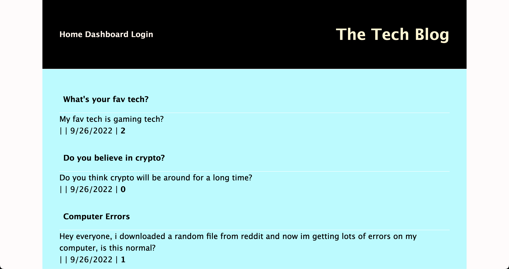

# 14 Model-View-Controller (MVC): Tech Blog

## Description 
Writing about tech can be just as important as making it. Developers spend plenty of time creating new applications and debugging existing codebases, but most developers also spend at least some of their time reading and writing about technical concepts, recent advancements, and new technologies. A simple Google search for any concept covered in this course returns thousands of think pieces and tutorials from developers of all skill levels!

Our task this week was to build a CMS-style blog site similar to a Wordpress site, where developers can publish their blog posts and comment on other developers’ posts as well. You’ll build this site completely from scratch and deploy it to Heroku. Your app will follow the MVC paradigm in its architectural structure, using Handlebars.js as the templating language, Sequelize as the ORM, and the express-session npm package for authentication.

This is an important activity as it allowed us to implement our handlebars and sequelize skills, practice and show our understanding of routes (get, post, put, delete), demonstrate our understanding of one to one and one to many relationships and continue our understanding of async functions. 

To view the application live on Heroku [please click](https://polar-tundra-36305.herokuapp.com/) 

## Table of Contents 
- [Installation](#installation)
- [Usage](#usage)
- [Features](#features)

## Installation
Once the user has cloned the project from GitHub there are a few steps they must undertake in order to get the application running.

You’ll need to open the command terminal and input 'npm install' to install all the neccessary dependencies. 

Use the `schema.sql` file in the `db` folder to create your database with MySQL shell commands. Use environment variables to store sensitive data like your MySQL username, password, and database name.

Once the schema has been established, you need to 'seed' the database. 
This is done by running  `npm run seed` to seed data to your database so that you can test your routes.

Once the seeds have been executed create the code needed in `server.js` to sync the Sequelize models to the MySQL database on server start.

## Usage
To use the application please view it live on Heroku. You can click [here to view it on Heroku](https://polar-tundra-36305.herokuapp.com/)

## Features
- express-handlebars 
- express-session
- connect-session-sequelize
- bcrypt
- node.js
- mySQL
- sequelize
- dotenv 
- path